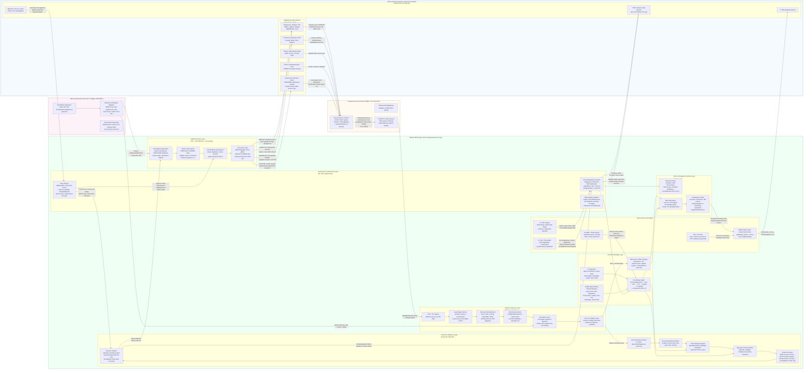

# MSSP / SOC архитектура

```mermaid
flowchart LR
    %% ================= ЗОНЫ =================
    classDef zoneCust fill:#f5faff,stroke:#2b6cb0,stroke-width:1px;
    classDef zoneDMZ fill:#fffaf0,stroke:#c05621,stroke-width:1px;
    classDef zoneCloud fill:#f0fff4,stroke:#2f855a,stroke-width:1px;
    classDef zoneInternal fill:#fdf2f8,stroke:#b83280,stroke-width:1px;

    %% ============ 1. ИНФРАСТРУКТУРА КЛИЕНТА ============
    subgraph Z1["Зона клиента (on‑prem / клиентское облако)"]
        direction TB

        subgraph C_BIZ["Клиентская оргструктура"]
            direction TB
            C_IT["IT / ИБ команда клиента"]
            C_MGMT["Business / Service owner,\nCISO / CIO, менеджмент"]
            C_ITSM["ITSM / Service Desk клиента\n(Jira, ServiceNow, RT, др.)"]
        end

        subgraph C_INFRA["Инфраструктура клиента\n(генераторы логов)"]
            direction TB
            C_EP["Эндпоинты, сервера, VDI,\nAD/DC, файло-серверы\n(EDR/AV/OS логи)"]
            C_NET["Сетевые устройства, VPN,\nFirewall, WAF, Proxy, IDS/IPS"]
            C_SaaS["Клиентские облака и SaaS:\nO365/M365, публичные облака\n(Yandex Cloud, AWS, Azure и др.)"]
            C_APP["Бизнес-приложения и БД\n(audit, access, security logs)"]
            C_OT["OT/IoT, промышленные сети,\nNTA/DLP сенсоры (опция)"]
        end
    end
    class Z1 zoneCust

    %% ============ 2. ПРИГРАНИЧНАЯ ЗОНА / КОЛЛЕКТОР ============
    subgraph Z2["Пограничная зона клиента (DMZ / лог-коллектор)"]
        direction TB
        COLLECTOR["Лог-коллектор / Sensor\n(Tenzir node / syslog collector / NXLog/Beats)\n— разворачивается у клиента"]
        C_BUF["Локальный буфер/кэш,\nочередь, ретрай (disk / queue)"]
        C_SEC["TLS/mTLS, VPN-туннель,\nNAT, egress‑политики\n(разрешённые адреса MSSP)"]
    end
    class Z2 zoneDMZ

    %% Связи генераторов с коллектором
    C_EP -->|"Syslog / агент / EDR API\n(Windows Events, AV, EDR, OS)"| COLLECTOR
    C_NET -->|"Syslog, NetFlow, Zeek/Suricata,\nFW/WAF/Proxy логи"| COLLECTOR
    C_APP -->|"App/DB audit, access logs"| COLLECTOR
    C_OT -->|"OT/IoT события, NTA/DLP"| COLLECTOR
    C_SaaS -->|"Cloud Audit / API / Webhooks\n(CloudTrail, Activity Logs и т.п.)"| COLLECTOR

    COLLECTOR -->|"Нормализованные/упакованные логи\n(например, Tenzir Arrow, JSON)\nпо TLS/VPN"| C_SEC
    C_SEC -->|"Зашифрованный канал\nв облако MSSP"| GW_MSSP

    %% ============ 3. ОБЛАКО MSSP (CORE ПЛАТФОРМА) ============
    subgraph Z3["Облако MSSP (ваш SOC‑платформенный контур)"]
        direction TB

        %% --- 3.1 Ingest & Transport Layer (в облаке) ---
        subgraph Cloud_Ingest["Ingest & Transport Layer\n(Tenzir Ingest Cluster)"]
            direction TB
            GW_MSSP["VPN / TLS ingress\n(Reverse proxy, LB, API GW)"]
            T_Input["Input Nodes (Tenzir):\nприём потоков от коллекторов,\ncloud‑sources (S3, Kafka, HTTP)"]
            T_Parse["Parsing & Normalization:\nECS / VAST schema, CEF/LEEF, JSON,\nWindows Events, NTA форматы"]
            T_Enrich["Enrichment (online):\nCMDB MSSP/клиента, GeoIP, ASN,\nuser/host attributes, базовый CTI"]
            T_Corr["Correlation Layer:\nrule-based, sequence detection,\ndedup, alert suppression,\nIoC pivoting"]
            T_Fanout["Fan-out / Output Layer:\nстримы в SIEM, Data Lake,\nResponse-Operator, S3/Kafka"]
        end

        %% --- 3.2 Decision Intelligence Layer ---
        subgraph Cloud_Decision["Decision Intelligence Layer\n(Response-Operator)"]
            direction TB
            R_Enriched["Enriched Events Stream\nиз Tenzir (высокообогащённые объекты)"]
            R_Interpret["Event Interpretation Engine:\nEvidence Set (src/dst, user,\nasset, IOC, history)"]
            R_MITRE["Threat Mapping Engine:\nMITRE ATT&CK, D3FEND, ENGAGE,\nCyber Kill Chain, UCKC"]
            R_Bayes["Bayesian Scoring Module:\nP(threat), P(stage), P(lateral movement),\nP(impact)"]
            R_OODA["OODA Controller:\nObserve (from Tenzir) →\nOrient (context+graph) →\nDecide (mode, severity) →\nAct (playbook, action set)"]
            R_Mode["Decision Outputs:\nCategory, Severity, Impact,\nResponse Mode (Enrich-only,\nInvestigation, Semi-auto, Full-auto)"]
        end

        %% --- 3.3 SOAR Execution Layer ---
        subgraph Cloud_SOAR["SOAR Execution Layer\n(n8n + S3 Playbooks + интеграции)"]
            direction TB
            N_PlaybookRepo["S3 Playbook Repository:\nверсионированные YAML/JSON playbooks,\natomic steps, checksums, rollback"]
            N_Atomic["Atomic Step Library:\nEDR actions, FW/WAF rules,\nAD/IDP actions, Cloud API,\nITSM интеграции и т.п."]
            N_Exec["n8n Workflow Orchestrator:\nзапуск playbooks, retries, backoff,\naudit, step‑level metrics"]
            N_Connect["Connector Layer:\nREST/GraphQL, SSH, gRPC,\nEDR API, FW/WAF API,\nCloud provider API, ITSM API"]
        end

        %% --- 3.4 Data & Knowledge Layer ---
        subgraph Cloud_Data["Data & Knowledge Layer"]
            direction TB
            D_UM["Unified Data Model & Schema Registry:\nAsset, Host, User, Application,\nEvent, Alert, Incident, IOC, TTP,\nCampaign, Threat Actor"]
            D_KG["Knowledge Graph:\nсвязи между asset ↔ user ↔ IOC ↔ TTP ↔ incident ↔ campaign\n+ история IR, PIR, CTI"]
            D_CTI["CTI Ingestion:\nMISP, STIX/TAXII, vendor feeds\n(обогащает Knowledge Graph, Tenzir, RO)"]
            D_Datalake["Data Lake / SIEM / Storage:\nClickHouse / S3 / Elasticsearch / Splunk\n(сырьё + обогащённые события)"]
        end

        %% --- 3.5 Governance & Operations Layer ---
        subgraph Cloud_Gov["Governance & Operations Layer\n(IR / SOC управление)"]
            direction TB
            G_Case["Case Management System:\nинциденты, IR lifecycle NIST/SANS/ISO,\nтаймлайны, SLA, статусы,\nкоммуникация с клиентом"]
            G_Policy["Policy Engine:\nRBAC/ABAC, VIP/critical assets,\napprove‑workflow, whitelist/blacklist\natomic steps, ограничения full‑auto"]
            G_Obs["Observability & Metrics:\nhealth Tenzir/RO/n8n/LLM,\nMTTD/MTTR, ATT&CK coverage,\naudit trails, KPI dashboard"]
        end

        %% --- 3.6 Ad-hoc Intelligence Content Layer (LLM) ---
        subgraph Cloud_LLM["Ad-hoc Intelligence Content Layer\n(AICE / LLM)"]
            direction TB
            L_DocStore["Document Store:\nrunbooks, SOP, IR‑политики,\nBAS‑отчёты, PCI/ISO документы,\nисторические PIR отчёты"]
            L_RAG["RAG Subsystem:\nпоиск по Case Mgmt, Knowledge Graph,\nлогам, CTI, документации"]
            L_Gen["LLM Engine (AICE):\nexecutive summaries, PIR отчёты,\nрекомендации по hardening,\nчерновики playbooks/detections"]
        end

        %% --- 3.7 SOC Team / Portal ---
        subgraph Cloud_SOC["SOC Portal и роли MSSP"]
            direction TB
            S_L1["L1 SOC Analyst:\nмониторинг, первичный triage,\nработа с алертами/кейсами"]
            S_L2["L2 SOC / IR Handler:\nрасследование, containment,\nручной запуск playbooks"]
            S_L3["L3 DFIR / Threat Hunter:\nглубокий анализ, hunting,\nRCA, тюнинг детектов"]
            S_Lead["SOC / IR Lead:\nSLA, отчётность клиенту,\nPIR, roadmap улучшений"]
            S_Portal["MSSP SOC Portal / клиентский портал:\nдашборды, кейсы, отчёты,\nSLA, коммуникация"]
        end
    end
    class Z3 zoneCloud

    %% ============ 4. ВНУТРЕННЕЕ ОБЛАКО ВАШЕЙ КОМПАНИИ (ОПЦИОНАЛЬНО) ============
    subgraph Z4["Ваш внутренний контур (Dev / Staging / Backoffice)"]
        direction TB
        INT_Dev["Dev/Stage окружения Tenzir, RO, n8n,\nтестирование playbooks и детектов"]
        INT_Reg["Detection & Playbook Registry:\nDETECT-as-code, playbook-as-code,\ncode review, CI/CD в S3 и RO"]
        INT_BI["Internal BI & Reporting:\nфинансовые отчёты, SLA, загрузка SOC\n(не доступно клиенту)"]
    end
    class Z4 zoneInternal

    %% ======== ПОТОКИ ВНУТРИ ОБЛАКА MSSP ========

    %% Ingest chain
    GW_MSSP --> T_Input --> T_Parse --> T_Enrich --> T_Corr --> T_Fanout
    T_Fanout -->|"Stream enriched events"| R_Enriched
    T_Fanout -->|"Raw + enriched data"| D_Datalake

    %% Decision chain
    R_Enriched --> R_Interpret --> R_MITRE --> R_Bayes --> R_OODA --> R_Mode

    %% Decision to Case & SOAR
    R_Mode -->|"Create/Update Incident,\ncategory, severity, impact"| G_Case
    R_Mode -->|"Select playbook,\natomic step set"| N_PlaybookRepo

    %% SOAR chain
    N_PlaybookRepo --> N_Atomic --> N_Exec --> N_Connect

    %% CTI & Knowledge Graph
    D_CTI --> D_KG
    D_UM --> D_KG
    G_Case --> D_KG
    D_KG --> R_MITRE
    D_KG --> R_Bayes

    %% Governance influence
    G_Policy -->|"Constraints on Response Mode\n(Enrich-only / Semi-auto / Full-auto)"| R_Mode
    G_Policy -->|"Approve / deny\nвыполнение определённых\natomic steps"| N_Exec

    %% LLM usage
    G_Case --> L_DocStore
    D_KG --> L_RAG
    D_Datalake --> L_RAG
    L_RAG --> L_Gen
    L_Gen -->|"Executive summary, PIR,\nвнутренние/клиентские отчёты"| S_Portal

    %% SOC roles
    S_L1 -->|"Работа через SOC Portal\nс алертами/инцидентами"| G_Case
    S_L2 -->|"Расследование, запуск playbooks,\nтюнинг Response-Mode\n(в пределах Policy Engine)"| G_Case
    S_L3 -->|"Hunting, RCA, tюнинг детектов,\nобновление Registry / Graph"| D_KG
    S_Lead -->|"Отчётность клиенту,\nroadmap, PIR сессии"| S_Portal

    %% CI/CD во внутренний контур
    INT_Dev --> INT_Reg -->|"Deploy playbooks/detections\nв прод (S3, RO)"| N_PlaybookRepo
    INT_Reg -->|"Deploy detection logic\nв Tenzir / SIEM"| T_Corr

    %% ======== ВЗАИМОДЕЙСТВИЕ MSSP ↔ КЛИЕНТ ========

    %% Итоговые действия SOAR в сторону клиента
    N_Connect -->|"EDR API: изоляция хоста,\nкилл процесса, сбор артефактов"| C_EP
    N_Connect -->|"FW/WAF API: блокировка IP/URL,\nсоздание правил, rate‑limit"| C_NET
    N_Connect -->|"Cloud API: revoke токены,\nсмена ролей, quarantine ресурсов"| C_SaaS
    N_Connect -->|"AD/IDP API: disable/lock account,\nпароль reset, MFA enforce"| C_EP

    %% Case Mgmt ↔ ITSM клиента
    G_Case -->|"Incidents, alerts,\nIR status, SLA, отчёты"| C_ITSM
    C_ITSM -->|"Комментарии, approvals,\nchange-заявки, бизнес-контекст"| G_Case

    %% SOC Portal ↔ клиент
    S_Portal -->|"Dashboards, отчёты,\nPIR материалы, SLA"| C_IT
    C_MGMT -->|"Политики, risk appetite,\napprove уровней автоматизации"| G_Policy
```
